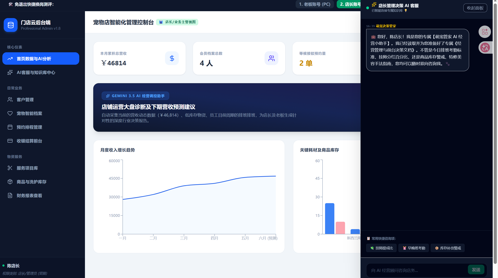
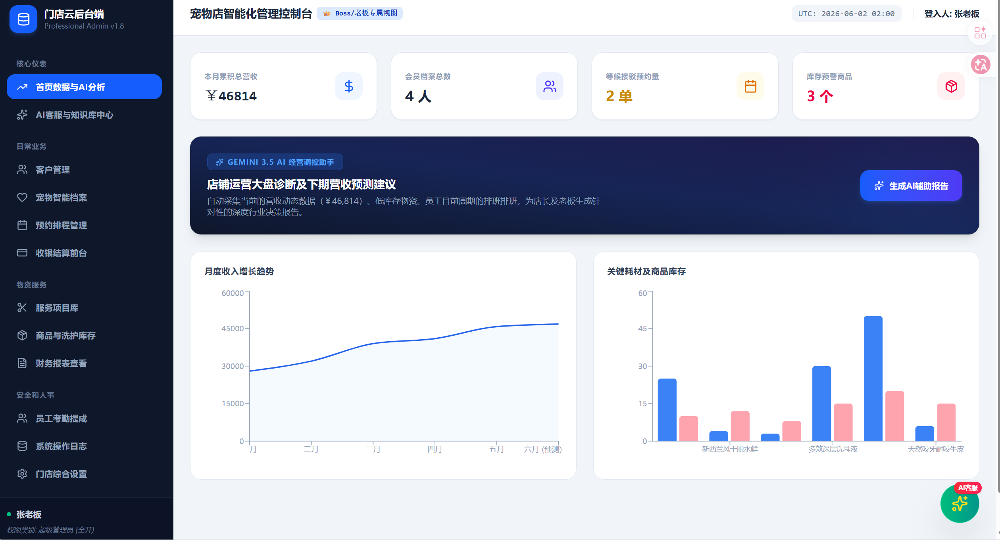
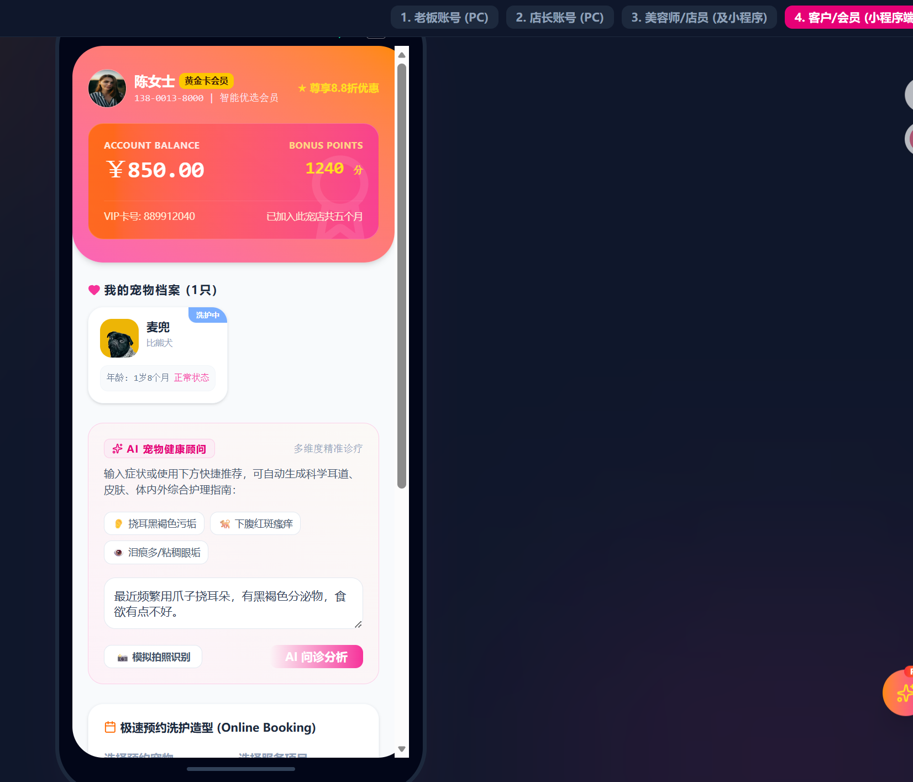

# 🐾 Pet Smart System - 宠物智能管理系统

<div align="center">


**基于 FastAPI + React + PostgreSQL 的智能宠物店管理平台**

[](https://www.python.org/)
[](https://fastapi.tiangolo.com/)
[](https://reactjs.org/)
[](https://www.postgresql.org/)
[](LICENSE)

</div>

---

## 📖 项目简介

Pet Smart System 是一个面向宠物店的全栈智能管理系统，集成了 AI 智能客服、知识库管理、经营分析等功能。系统采用前后端分离架构，后端使用 Python FastAPI，前端使用 React + TypeScript，数据存储使用 PostgreSQL。

### ✨ 核心特性

- 🤖 **AI 智能客服**：基于 Gemini AI 的多角色智能问答系统
- 📚 **知识库管理**：支持管理员、员工、顾客三种角色的知识库
- 📊 **经营分析**：AI 驱动的店铺经营数据分析与预测
- 🐕 **宠物健康问诊**：AI 辅助的宠物健康咨询与建议
- ✂️ **洗护推荐**：智能洗护美容方案推荐
- 📱 **多端适配**：支持 PC、平板、手机等多种设备

---

## 🖥️ 产品截图


### 管理员工作台
<div align="center">



</div>

### 老板（超级管理员）端
<div align="center">



</div>

### 客户小程序页面
<div align="center">



</div>

---

## 🏗️ 技术架构

```
pet_manage/
├── row/
│   ├── backend/                # Python FastAPI 后端
│   │   ├── app/
│   │   │   ├── __init__.py
│   │   │   ├── main.py         # 应用入口
│   │   │   ├── config.py       # 配置管理
│   │   │   ├── database.py     # 数据库连接与模型
│   │   │   ├── gemini.py       # Gemini AI 集成
│   │   │   └── routes/
│   │   │       ├── kb.py       # 知识库 API
│   │   │       └── chat.py     # AI 聊天 API
│   │   ├── requirements.txt    # Python 依赖
│   │   └── venv/               # 虚拟环境
│   ├── src/                    # React 前端源码
│   │   ├── components/
│   │   │   ├── AdminWorkspace.tsx    # 管理员工作台
│   │   │   ├── GroomerMobile.tsx     # 员工端
│   │   │   ├── CustomerMobile.tsx    # 顾客端
│   │   │   └── LoginLayout.tsx       # 登录页面
│   │   ├── App.tsx             # 主应用组件
│   │   ├── data.ts             # 模拟数据
│   │   └── types.ts            # TypeScript 类型定义
│   ├── vite.config.ts          # Vite 配置
│   └── package.json            # 前端依赖
```

---

## 🚀 快速开始

### 环境要求

- **Python** >= 3.11
- **Node.js** >= 18.0
- **PostgreSQL** >= 14.0
- **npm** 或 **yarn**

### 1. 克隆项目

```bash
git clone https://github.com/SSA-AFK/pets_agent_platform.git
cd pets_agent_platform/row
```

### 2. 配置 PostgreSQL 数据库

创建数据库：
```sql
CREATE DATABASE pet_manage;
```

### 3. 配置环境变量

复制环境变量示例文件：
```bash
cp .env.example .env
```

编辑 `.env` 文件，配置数据库连接：
```env
# PostgreSQL 数据库配置
DATABASE_HOST="localhost"
DATABASE_PORT="5432"
DATABASE_NAME="pet_manage"
DATABASE_USER="postgres"
DATABASE_PASSWORD="your_password"

# Gemini AI API Key（可选，用于 AI 功能）
GEMINI_API_KEY="your_gemini_api_key"
```

### 4. 启动后端

```bash
cd backend

# 创建虚拟环境
python -m venv venv

# 激活虚拟环境（Windows）
.\venv\Scripts\activate

# 激活虚拟环境（macOS/Linux）
source venv/bin/activate

# 安装依赖
pip install -r requirements.txt

# 启动服务
uvicorn app.main:app --reload --port 8000
```

后端服务将在 http://localhost:8000 启动

API 文档：http://localhost:8000/docs

### 5. 启动前端

```bash
# 返回项目根目录
cd ..

# 安装依赖
npm install

# 启动开发服务器
npm run dev
```

前端应用将在 http://localhost:5173 启动

---

## 📡 API 接口

### 知识库管理

| 接口 | 方法 | 说明 |
|------|------|------|
| `/api/kb` | GET | 获取所有知识库 |
| `/api/kb` | POST | 更新指定知识库 |
| `/api/kb/upload` | POST | 上传文档并解析 |

### AI 智能服务

| 接口 | 方法 | 说明 |
|------|------|------|
| `/api/gemini/chat` | POST | 角色化 AI 智能客服 |
| `/api/gemini/analyze-business` | POST | AI 经营分析 |
| `/api/gemini/suggest-grooming` | POST | AI 洗护推荐 |
| `/api/gemini/pet-health` | POST | AI 宠物健康问诊 |

### 请求示例

```javascript
// AI 智能客服
const response = await fetch('/api/gemini/chat', {
  method: 'POST',
  headers: { 'Content-Type': 'application/json' },
  body: JSON.stringify({
    role: 'customer',
    message: '我的猫咪最近总是挠耳朵，怎么办？'
  })
});
```

---

## 🎯 功能模块

### 👑 管理员端
- 📊 经营数据仪表盘
- 💰 营收与利润分析
- 👥 员工排班管理
- 📦 库存预警与订货
- 📚 知识库管理与更新

### ✂️ 员工端
- 📅 预约日程查看
- 🐕 宠物信息查看
- 🧴 AI 洗护方案推荐
- 📋 服务记录填写

### 🐾 顾客端
- 📅 在线预约服务
- 💊 AI 宠物健康问诊
- 💳 会员卡与积分
- 📜 服务历史记录

---

## 🤖 AI 功能说明

系统集成了 Google Gemini AI，提供以下智能功能：

1. **智能客服**：基于知识库的多角色 AI 问答
2. **经营分析**：基于销售数据的 AI 经营建议
3. **洗护推荐**：根据宠物特征的个性化洗护方案
4. **健康问诊**：AI 辅助的宠物健康咨询

> 💡 **提示**：如果没有配置 Gemini API Key，系统会自动切换到模拟模式，返回预设的示例数据。

---

## 🛠️ 开发指南

### 项目结构说明

- `backend/app/routes/` - API 路由定义
- `backend/app/database.py` - 数据库模型与操作
- `backend/app/gemini.py` - AI 服务集成
- `src/components/` - React 组件
- `src/data.ts` - 前端模拟数据

### 添加新的 API 接口

1. 在 `backend/app/routes/` 目录创建新的路由文件
2. 在 `backend/app/main.py` 中注册路由
3. 在前端使用 `fetch` 调用接口

### 数据库迁移

```bash
# 进入后端目录
cd backend

# 激活虚拟环境
.\venv\Scripts\activate

# 运行数据库初始化
python -c "import asyncio; from app.database import init_db; asyncio.run(init_db())"
```

---

## 📦 部署

### 生产环境部署

1. **构建前端**
```bash
npm run build
```

2. **配置 Nginx**
```nginx
server {
    listen 80;
    server_name your-domain.com;

    location / {
        root /path/to/dist;
        try_files $uri $uri/ /index.html;
    }

    location /api {
        proxy_pass http://localhost:8000;
        proxy_set_header Host $host;
        proxy_set_header X-Real-IP $remote_addr;
    }
}
```

3. **使用 Gunicorn 运行后端**
```bash
cd backend
gunicorn app.main:app -w 4 -k uvicorn.workers.UvicornWorker -b 0.0.0.0:8000
```

### Docker 部署（可选）

```dockerfile
# 后端 Dockerfile
FROM python:3.13-slim
WORKDIR /app
COPY backend/requirements.txt .
RUN pip install -r requirements.txt
COPY backend/ .
CMD ["uvicorn", "app.main:app", "--host", "0.0.0.0", "--port", "8000"]
```

---

## 🤝 贡献指南

欢迎贡献代码！请遵循以下步骤：

1. Fork 本仓库
2. 创建特性分支：`git checkout -b feature/your-feature`
3. 提交更改：`git commit -m 'Add some feature'`
4. 推送分支：`git push origin feature/your-feature`
5. 提交 Pull Request

---

## 📄 许可证

本项目采用 [MIT License](LICENSE) 开源许可证。

---

## 📞 联系方式

- **作者**：SSA-AFK
- **GitHub**：[@SSA-AFK](https://github.com/SSA-AFK)
- **项目链接**：[pets_agent_platform](https://github.com/SSA-AFK/pets_agent_platform)

---

<div align="center">

**⭐ 如果这个项目对你有帮助，请给个 Star 支持一下！⭐**

Made with ❤️ by Pet Smart Team

</div>
